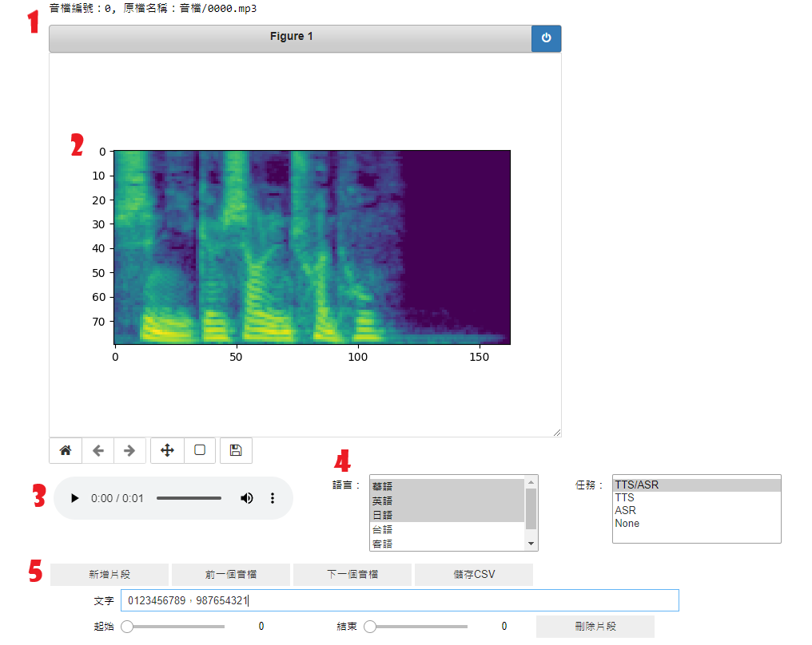

# TTS-dataset-editor
TTS資料集編輯的程式，處理自己蒐集的聲音資料集

---
## Preprocess script

### _**/ audio_preprocess_script / 01_segmentation.py**_  
利用 **ffmpeg** 將過長的音檔切成固定長度的數段子音檔  

* 輸入參數 root_of_datasets： 數個資料集的根目錄 

資料集根目錄  
&emsp;&emsp; ├─ 資料集 A  
&emsp;&emsp; │&emsp;&emsp; ├─ 音檔 A.wav  
&emsp;&emsp; │&emsp;&emsp; ├─ 音檔 B.wav  
&emsp;&emsp; │&emsp;&emsp; ├─ 音檔 C.wav  
&emsp;&emsp; │  
&emsp;&emsp; ├─ 資料集 B  
&emsp;&emsp; │&emsp;&emsp; ├─ 音檔 D.wav  
&emsp;&emsp; │&emsp;&emsp; ├─ 音檔 E.wav  
&emsp;&emsp; │&emsp;&emsp; ├─ 音檔 F.wav  

* 輸入參數 length： 想要分割的長度 (以秒為單位)  

---
### _**/ audio_preprocess_script / 02_vad.py**_  
利用 **snakers4/silero-vad** 將音檔進行切音處理   

* 輸入參數 dataset_root： 資料集目錄 

資料集目錄  
&emsp;&emsp; ├─ 音檔 A.wav  
&emsp;&emsp; ├─ 音檔 B.wav  
&emsp;&emsp; ├─ 音檔 C.wav  

---
### _**/ audio_preprocess_script / 03_whisper_v3.py**_  
利用 **openai/whisper-large-v3** 將音檔進行語音文字辨識  

* 輸入參數 dataset_root： VAD 處理後的資料集目錄 

資料集目錄  
&emsp;&emsp; ├─ 音檔 A  
&emsp;&emsp; │&emsp;&emsp; ├─ 片段 A.mp3  
&emsp;&emsp; │&emsp;&emsp; ├─ 片段 B.mp3  
&emsp;&emsp; │&emsp;&emsp; ├─ 片段 C.mp3  
&emsp;&emsp; │  
&emsp;&emsp; ├─ 音檔 B  
&emsp;&emsp; │&emsp;&emsp; ├─ 片段 D.mp3  
&emsp;&emsp; │&emsp;&emsp; ├─ 片段 E.mp3  
&emsp;&emsp; │&emsp;&emsp; ├─ 片段 F.mp3  
&emsp;&emsp; │  
&emsp;&emsp; └─ vad_reasult.txt

---
### _**/ audio_preprocess_script / 04_punctuation_restore.py**_  
利用 **p208p2002/zh-wiki-punctuation-restore** 將 Whisper 辨識過後的文字補上標點符號  

* 輸入參數 dataset_root： Whisper V3 處理後的資料集目錄 

資料集目錄  
&emsp;&emsp; ├─ 音檔 A  
&emsp;&emsp; │&emsp;&emsp; ├─ 片段 A.mp3  
&emsp;&emsp; │&emsp;&emsp; ├─ 片段 B.mp3  
&emsp;&emsp; │&emsp;&emsp; ├─ 片段 C.mp3  
&emsp;&emsp; │  
&emsp;&emsp; ├─ 音檔 B  
&emsp;&emsp; │&emsp;&emsp; ├─ 片段 D.mp3  
&emsp;&emsp; │&emsp;&emsp; ├─ 片段 E.mp3  
&emsp;&emsp; │&emsp;&emsp; ├─ 片段 F.mp3  
&emsp;&emsp; │  
&emsp;&emsp; ├─ vad_reasult.txt  
&emsp;&emsp; └─ whisper_reasult.txt

---
## Editor UI
基於Jupyter notebook的資料集編輯介面

* 編號 1 ：顯示音檔檔名、在資料集中的音檔編號、語音檔是否可用
* 編號 2 ：顯示音檔轉為轉為 mel spectrogram 的結果
* 編號 3 ：播放整段音檔
* 編號 4 ：音檔編輯介面。可以為音檔新增/刪除片段、編輯片段時間、邊集片段文本內容與啟用/不啟用音檔
